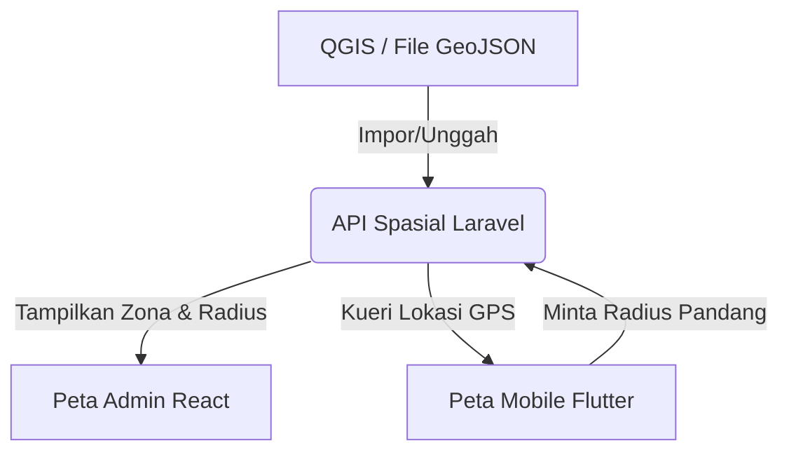

# Rencana Pengembangan Fitur (Roadmap): QGIS Mobile, Laravel Backend, & Dashboard React

Dokumen ini berisi rencana pengembangan fitur masa depan untuk menyelaraskan aplikasi Flutter (Mobile), API Laravel (Backend), dan React (Dashboard Web Admin).

---

## Fase 1: Peta & Spasial (Integrasi GIS & QGIS)

Fase ini berfokus pada visualisasi spasial canggih untuk mempermudah pencarian titik billboard, analisis wilayah, dan kalkulasi radius pandang.

### 1. API Backend (Laravel + PostGIS)
- **Kueri Pencarian Berbasis Radius (Spatial Query)**: Menyediakan API untuk mencari billboard terdekat dari koordinat pengguna menggunakan fungsi spasial PostGIS (misal: `ST_DWithin` dan `ST_Distance`).
- **Impor/Ekspor GeoJSON**: Fitur untuk mengunggah berkas spasial (GeoJSON) hasil ekspor dari QGIS ke database (seperti batas kecamatan, kepadatan lalu lintas, dan zona pelarangan iklan).
- **Kalkulasi Radius Jangkauan**: Menyimpan buffer jangkauan visual (misal: jangkauan pandang 100m, 200m) untuk setiap titik billboard.

### 2. Aplikasi Mobile (Flutter)
- **Fitur Deteksi Billboard Terdekat**: Otomatis mendeteksi lokasi GPS pengguna dan menampilkan notifikasi pop-up saat melewati area billboard premium yang kosong.
- **Overlay Radius Pandang**: Menggambar lingkaran transparan di atas peta Flutter yang menunjukkan visualisasi jangkauan pandang billboard tersebut.
- **Navigasi & Rute**: Integrasi dengan peta bawaan atau Google Maps SDK untuk memberikan rute perjalanan fisik menuju titik billboard untuk inspeksi.

### 3. Dashboard Web (React Admin)
- **Peta Kepadatan Lalu Lintas (Heatmap)**: Menampilkan visualisasi area dengan lalu lintas tinggi menggunakan koordinat lalu lintas di Leaflet.
- **Analisis Tumpang Tindih Jangkauan (Overlay Analysis)**: Membantu admin menganalisis jika ada billboard yang saling menutupi pandangan satu sama lain.
- **Manajemen Layer Batas Wilayah**: Tombol untuk mematikan/menghidupkan layer administratif seperti batas kecamatan atau zona khusus komersial.

---

## Fase 2: Alur Unggah Desain Kreatif & Moderasi (Creative Approval)

Memungkinkan klien mengunggah file desain iklan mereka melalui aplikasi mobile, lalu divalidasi dan disetujui oleh admin sebelum dicetak atau dipasang.

### 1. Aplikasi Mobile (Flutter)
- **Pusat Unggah Desain (Creative Center)**: Halaman khusus bagi klien untuk mengunggah materi gambar/video banner iklan (`.png`, `.jpg`, `.mp4`).
- **Pratinjau Frame Billboard**: Visualisasi simulasi desain iklan yang dipasang pada frame billboard di layar HP.
- **Validasi Spesifikasi File**: Pemeriksaan otomatis sebelum unggah untuk memastikan rasio aspek (misal 4:3 atau 16:9) dan resolusi file sudah sesuai standar cetak.

### 2. API Backend (Laravel)
- **Media Library & Integrasi Cloud (AWS S3/MinIO)**: Sistem penyimpanan file multimedia yang aman dengan versi file.
- **Status Alur Persetujuan (Approval Workflow)**: Mengelola siklus status desain: `waiting_design` (menunggu desain), `in_review` (sedang ditinjau), `design_rejected` (desain ditolak), `design_approved` (desain disetujui).
- **Notifikasi Push & Email**: Memberitahu klien secara real-time ketika status desain mereka diubah oleh admin.

### 3. Dashboard Web (React Admin)
- **Moderasi Materi Iklan**: Halaman untuk memeriksa berkas desain yang diunggah oleh klien.
- **Media Player Terintegrasi**: Pemutar video/gambar langsung di tabel peninjauan untuk memeriksa detail visual iklan secara cepat.
- **Formulir Feedback Penolakan**: Fitur mengirim alasan penolakan jika desain tidak disetujui (misal: "Resolusi terlalu pecah" atau "Konten melanggar kebijakan") agar klien dapat mengunggah ulang di aplikasi mobile.

---

## Fase 3: Pemeliharaan & Laporan Lapangan (Maintenance Dispatch)

Alur pelaporan kerusakan atau pemeliharaan billboard (misal lampu padam, rangka berkarat, atau banner robek) langsung dari lapangan.

### 1. Aplikasi Mobile (Mode Teknisi / Surveyor)
- **Pintu Masuk Surveyor**: Akses menu khusus untuk staf lapangan atau surveyor komersial.
- **Pelaporan Cepat Kerusakan**: Fitur mengambil foto kerusakan billboard langsung dengan kamera HP, mengunci lokasi GPS secara otomatis, dan memilih jenis kerusakan.
- **Offline Caching**: Laporan disimpan di memori HP jika sinyal internet buruk dan akan otomatis terkirim saat internet kembali stabil.

### 2. API Backend (Laravel)
- **Sistem Tiket Pemeliharaan (Ticketing API)**: Membuat tiket perawatan otomatis begitu laporan kerusakan diterima.
- **Alokasi Kru Perbaikan**: Memilih teknisi terdekat berdasarkan ketersediaan jadwal.
- **Pencatatan Biaya Perawatan**: Sistem pencatatan pengeluaran, bahan baku perbaikan, dan biaya jasa kontraktor pemeliharaan.

### 3. Dashboard Web (React Admin)
- **Pusat Kontrol Perbaikan (Dispatch Center)**: Menampilkan tanda peringatan (pin merah/kuning) pada peta untuk billboard yang membutuhkan perbaikan mendesak.
- **Manajemen Perintah Kerja (Work Order)**: Menugaskan tiket kerusakan kepada staf lapangan, mengatur tingkat prioritas (Rendah, Sedang, Tinggi), dan melacak waktu penyelesaian pekerjaan.
- **Analisis Biaya VS Pendapatan**: Membandingkan total pengeluaran perawatan billboard dengan pendapatan yang dihasilkan dari penyewaan billboard tersebut.

---

## Fase 4: Suite Akun Perusahaan & Keuangan (Corporate Billing)

Mengoptimalkan proses penagihan, manajemen pajak daerah reklame, diskon khusus, dan opsi pembayaran bertahap untuk klien korporasi.

### 1. API Backend (Laravel)
- **Generator Dokumen PDF**: Pembuatan otomatis Invoice tagihan dan Faktur Pajak PPN/Pajak Reklame berformat PDF.
- **Pengingat Perpanjangan Otomatis (Renewal Engine)**: Mengirimkan pengingat masa sewa habis 30 hari sebelum kontrak berakhir.
- **Mesin Promo & Diskon Bertingkat**: Menerapkan diskon berdasarkan volume sewa atau durasi sewa (misal: diskon sewa di atas 6 bulan).

### 2. Aplikasi Mobile (Flutter)
- **Akun Korporasi (Company Account)**: Satu akun perusahaan dapat diakses oleh beberapa staf (tim marketing, tim finance) dengan peran dan hak akses persetujuan bayar yang berbeda.
- **Unduh Dokumen PDF**: Akses cepat untuk mengunduh invoice tagihan dan surat kontrak sewa resmi secara mandiri.
- **Perpanjangan Sewa Cepat**: Tombol perpanjang sewa billboard dengan metode pembayaran instan TriPay.

### 3. Dashboard Web (React Admin)
- **Buku Besar Penjualan & Pajak**: Ekspor laporan keuangan bulanan yang ramah akuntansi (untuk pelaporan PPN & Pajak Reklame Daerah).
- **Manajemen Kredit Klien (Terms of Payment)**: Opsi pembayaran berjangka (misal: tempo 30 hari) bagi klien korporat terpercaya tanpa memerlukan pembayaran instan di awal.
- **Sistem Pengingat Tunggakan Massal**: Fitur mengirim email tagihan massal untuk penyewa yang memiliki pembayaran jatuh tempo.

---

## Tambahan Fitur: Manajemen Harga & Ukuran (Pricing Management)

Sangat memungkinkan dan direkomendasikan untuk menambahkan fitur Manajemen Harga agar admin bisa mengubah harga sewa secara dinamis dari dashboard admin, alih-alih menggunakan konstanta harga yang tertulis mati (*hardcoded*) di kode frontend.

Ada dua pendekatan terbaik untuk mengimplementasikan hal ini:

### Opsi A: Manajemen Harga Kustom per Billboard (Billboard-Specific Pricing)
- **Cara Kerja**: Admin dapat memasukkan nominal harga sewa secara bebas melalui input angka langsung di modal tambah/edit billboard (misal: memasukkan kolom angka `Harga per Bulan`).
- **Backend API**: Menyimpan input nominal langsung ke tabel `billboard_pricing` di database yang terhubung ke model `Billboard`.
- **Kelebihan**: Sangat fleksibel. Setiap billboard bisa memiliki harga unik tersendiri tergantung nilai lokasinya yang spesifik (misal, billboard di persimpangan lampu merah utama harganya bisa diset lebih mahal dibanding billboard di jalan biasa meskipun ukurannya sama).

### Opsi B: Manajemen Template Harga Ukuran (Size-Based Pricing Templates) - *Sangat Direkomendasikan*
- **Cara Kerja**: 
  1. Membuat tabel database baru bernama `billboard_packages` untuk menyimpan daftar ukuran dan harga default (misal: ukuran `4x8` dengan harga default `Rp 12.500.000` per bulan).
  2. Menyediakan menu khusus di dashboard admin untuk mengelola template ukuran dan harga default tersebut.
  3. Saat mengedit billboard, admin cukup memilih template paket tersebut.
- **Aplikasi Mobile (Flutter)**: Saat pengguna melakukan checkout/booking, aplikasi mengambil daftar harga langsung dari API backend secara dinamis. Jika admin mengubah harga paket di dashboard, harga pemesanan baru di aplikasi Flutter akan terupdate secara otomatis dan real-time.

